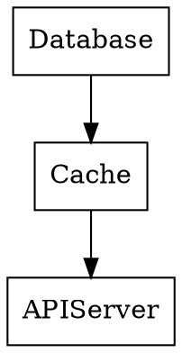

# GOscade

[](https://github.com/ognick/goscade/actions/workflows/go.yml)
[](https://pkg.go.dev/github.com/ognick/goscade/v2)
[](https://goreportcard.com/report/github.com/ognick/goscade)
[](https://codecov.io/gh/ognick/goscade)
[](https://opensource.org/licenses/MIT)

GOscade is a library for managing the lifecycle and dependencies of concurrent components in Go.

## Installation

```bash
go get github.com/ognick/goscade/v2
```

## Component Interface

To be managed by GOscade, a type must implement the `Component` interface:

```go
type Component interface {
    // Run starts the component.
    // It must call readinessProbe when the component is ready to serve.
    // It should block until ctx is canceled or a fatal error occurs.
    Run(ctx context.Context, readinessProbe func(cause error)) error
}
```

## Usage

### Basic Example

```go
package main

import (
    "context"
    "log"
    "time"

    "github.com/ognick/goscade/v2"
)

type Worker struct {
    Name string
}

func (w *Worker) Run(ctx context.Context, readinessProbe func(error)) error {
    log.Printf("Worker %s starting...", w.Name)
    
    // Simulate startup initialization
    time.Sleep(100 * time.Millisecond)
    readinessProbe(nil) // Signal readiness
    
    log.Printf("Worker %s ready", w.Name)

    <-ctx.Done() // Wait for shutdown signal
    
    log.Printf("Worker %s stopped", w.Name)
    return nil
}

// Simple logger adapter
type myLogger struct{}
func (l myLogger) Infof(f string, a ...interface{}) { log.Printf(f, a...) }
func (l myLogger) Errorf(f string, a ...interface{}) { log.Printf("ERROR: "+f, a...) }

func main() {
    // 1. Create Lifecycle manager
    lc := goscade.NewLifecycle(myLogger{}, goscade.WithShutdownHook())

    // 2. Register components
    goscade.Register(lc, &Worker{Name: "Core"})
    
    // 3. Run
    // Blocks until SIGINT/SIGTERM or error
    err := goscade.Run(context.Background(), lc, func() {
        log.Println("System is fully up and running!")
    })
    
    if err != nil {
        log.Fatal(err)
    }
}
```

### Dependency Injection

GOscade automatically detects dependencies between registered components if they are **struct pointers** or **interfaces**.

```go
type Database struct { /* ... */ }

// Service depends on Database via interface
type Service struct {
    DB interface{} // or specific interface like Storer
}

func main() {
    lc := goscade.NewLifecycle(log)

    db := &Database{}
    service := &Service{DB: db}

    // Order of registration doesn't matter
    goscade.Register(lc, service)
    goscade.Register(lc, db) 
    
    // GOscade detects that Service depends on Database.
    // It ensures Database is ready before Service starts.
}
```

If you need to declare dependencies that cannot be detected via reflection (e.g. hidden inside closures or non-struct fields), use explicit declaration:

```go
// Register service and declare it depends on db explicitly
goscade.Register(lc, service, db)
```

### Adapter Pattern

Use `NewAdapter` to wrap existing types (like `http.Server`) without defining a new struct.

```go
srv := &http.Server{Addr: ":8080"}

adapter := goscade.NewAdapter(srv, func(ctx context.Context, s *http.Server, probe func(error)) error {
    // Start server in background
    errChan := make(chan error, 1)
    go func() {
        if err := s.ListenAndServe(); err != http.ErrServerClosed {
            errChan <- err
        }
    }()

    // Signal ready (optionally verify port is listening first)
    probe(nil)

    // Wait for context cancellation or server error
    select {
    case <-ctx.Done():
        // Graceful shutdown
        return s.Shutdown(context.Background())
    case err := <-errChan:
        return err
    }
})

lc.Register(adapter)
```

### Configuration Options

```go
lc := goscade.NewLifecycle(logger,
    // Handle system signals (SIGINT, SIGTERM)
    goscade.WithShutdownHook(),
    
    // Set timeout for components to become ready
    goscade.WithStartTimeout(30 * time.Second),
    
    // Allow circular dependencies (use with caution)
    goscade.WithCircularDependency(),
    
    // Export dependency graph to DOT file on startup
    goscade.WithGraphOutput("graph.dot"),
)
```

### Dependency Graph Export

GOscade can export the component dependency graph in DOT format (Graphviz).

#### Get Graph Programmatically

```go
// Build graph structure
graph := lc.BuildGraph()

// Convert to DOT format
dotString := graph.ToDOT()
fmt.Println(dotString)
```

#### Auto-save to File

```go
// Graph will be saved to file when lifecycle starts
lc := goscade.NewLifecycle(logger, 
    goscade.WithGraphOutput("graph.dot"),
)
```

#### Visualize with Graphviz

```bash
# Generate PNG image
dot -Tpng graph.dot -o graph.png

# Generate SVG
dot -Tsvg graph.dot -o graph.svg

# Generate PDF
dot -Tpdf graph.dot -o graph.pdf
```

**Example DOT output:**



## Visual Examples

<table>
<tr>
<td align="center" valign="top" width="33%">
<br>
<b>Basic Workflow</b><br>
Components start in dependency order. Parents (dependencies) start first. Children start only after parents become ready. Shutdown happens in reverse order.
</td>
<td align="center" valign="top" width="33%">
<br>
<b>Startup Error</b><br>
If a component fails to start (returns error or fails probe), the lifecycle cancels the startup sequence and shuts down already started components gracefully.
</td>
<td align="center" valign="top" width="33%">
<br>
<b>Unexpected Shutdown</b><br>
If a running component stops unexpectedly (returns from Run), it triggers a system-wide shutdown to ensure inconsistent state is not maintained.
</td>
</tr>
</table>

## License

This project is licensed under the MIT License - see the [LICENSE](LICENSE) file for details.
