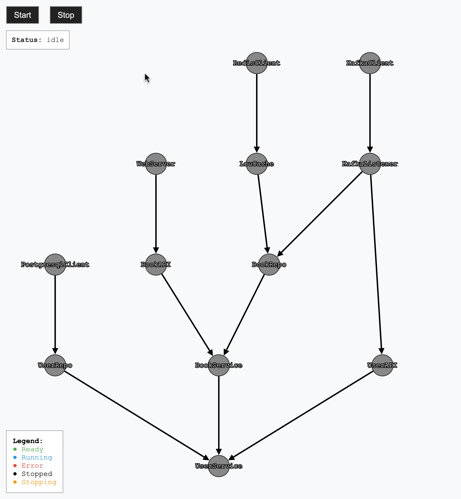

# GOscade

[](https://github.com/ognick/goscade/actions/workflows/go.yml)
[](https://opensource.org/licenses/MIT)

**GOscade** is a lightweight Go library for managing the lifecycle and dependencies of concurrent components. Unlike other solutions, goscade focuses on simplicity, automatic dependency detection, and proper lifecycle management in a concurrent environment.

goscade is a thin wrapper at the application's top level that doesn't penetrate into domain core logic. While the library ensures uniform component startup, it doesn't enforce architecture or affect business logic.

## Features

- **Automatic dependency detection** - No manual dependency declaration needed
- **Concurrent execution** - Components run in parallel when possible
- **Graceful shutdown** - Proper cleanup with dependency awareness
- **Health checks** - Built-in readiness probe system
- **Visual graph representation** - See your component dependencies
- **Adapter pattern** - Wrap existing components with custom logic
- **Circular dependency handling** - Optional support for circular dependencies
- **Configurable timeouts** - Set custom timeouts for component startup
- **Nested lifecycle** - Use lifecycle as a component in another lifecycle

## Installation

```bash
go get github.com/ognick/goscade
```

## Quick Start

```go
package main

import (
    "context"
    "errors"

    "github.com/ognick/goscade"
)

func main() {
    // Create lifecycle manager
    log := logger.NewLogger()
    lc := goscade.NewLifecycle(log)

    // Register components
    lc.Register(&Database{})
    lc.Register(&Cache{})
    lc.Register(&Service{})
    
    // Start all components with readiness probe
    waitGracefulShutdown := lc.Run(context.Background(), func(err error) {
        if err != nil {
            log.Errorf("readiness probe failed: %v", err)
        } else {
            log.Info("All components are ready")
        }
    })
    
    // Awaiting graceful shutdown
    if err := waitGracefulShutdown(); err != nil && !errors.Is(err, context.Canceled) {
        log.Errorf("%v", err)
    }
}
```

## Examples

<table>
<tr>
<td><br>Basic Workflow</td>
<td><br>Startup Error</td>
<td><br>Unexpected Shutdown</td>
</tr>
</table>

## Advanced Usage

### Adapter Pattern
Wrap existing components with custom logic:

```go
// Wrap an existing HTTP server with custom startup logic
server := &http.Server{Addr: ":8080"}
adapter := goscade.NewAdapter(server, func(ctx context.Context, srv *http.Server, probe func(error)) error {
    // Custom startup logic
    probe(nil) // Signal readiness
    return srv.ListenAndServe()
})

lc.Register(adapter)
```

### Fluent Registration API
Chain component creation and registration:

```go
// Using the fluent Register function
server := goscade.Register(lc, NewServer(handler))
db := goscade.Register(lc, NewDatabase(config))
cache := goscade.Register(lc, NewCache(db))
```

### Circular Dependency Support
Optional support for circular dependencies:

```go
lc := goscade.NewLifecycle(log, goscade.WithCircularDependency())
// Now components with circular dependencies won't cause panics
```

### Configurable Timeouts
Set custom timeouts for component startup:

```go
// Set 30 seconds timeout for component startup
lc := goscade.NewLifecycle(log, goscade.WithStartTimeout(30*time.Second))
// Components that do not become ready within 30 seconds will timeout
```

### Nested Lifecycle
Use lifecycle as a component in another lifecycle:

```go
// Create child lifecycle with components
childLC := goscade.NewLifecycle(log)
childLC.Register(&Database{})
childLC.Register(&Cache{})

// Register child lifecycle as component in parent
parentLC := goscade.NewLifecycle(log)
parentLC.Register(childLC.AsComponent())
parentLC.Register(&APIServer{})
```

## Requirements

- Go 1.22 or higher

## Technical Details

### Core Features
- Component lifecycle management (idle → running → ready → stopping → stopped)
- Automatic dependency graph building
- Topological sorting and component startup
- Readiness signaling via `readinessProbe`
- Graceful shutdown on context cancellation
- Error propagation through dependency graph
- Optional observability: dependency and state inspection

### Technical Limitations
- Components must be pointers or interfaces for proper dependency detection
- Circular dependencies are disabled by default (can be enabled with `WithCircularDependency()`)
- No built-in support for optional dependencies
- Graph is built using reflection on startup, which introduces overhead proportional to the number and complexity of components

## License

This project is licensed under the MIT License - see the LICENSE file for details.